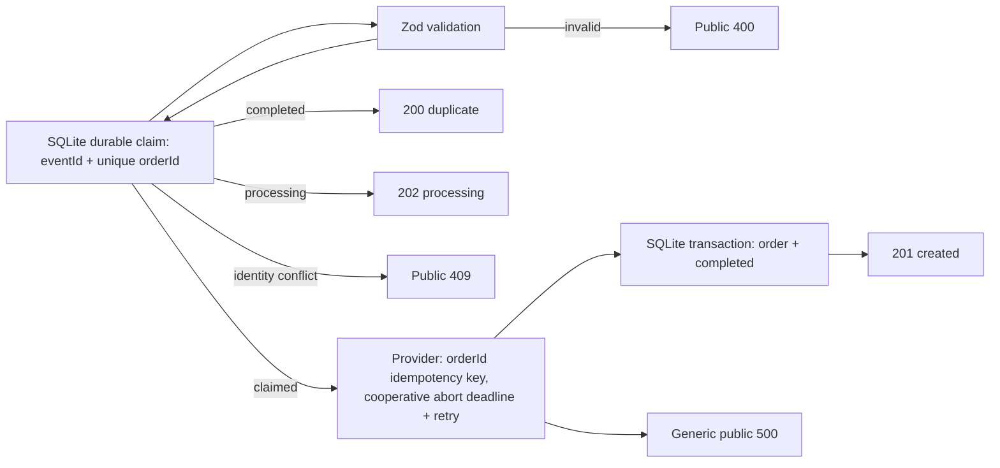

# Architecture

`webhook_events.event_id` is the unique transport-delivery identity and `webhook_events.order_id` is unique for the active/completed business operation. A matching event is processing/duplicate according to status; a changed payload under that event ID, or another event ID for the order, is a deterministic public 409 and does not call the provider. Only a newly claimed operation calls the provider; completion atomically inserts the order and marks its event `completed`. The provider contract must use `orderId` as its idempotency key because SQLite cannot atomically commit an external side effect. Its `AbortSignal` deadline is cooperative, so production adapters must map it to actual network cancellation. The mock has no network implementation. Crash recovery still needs stale-claim leasing/reconciliation and, where suitable, a durable workflow/outbox.
